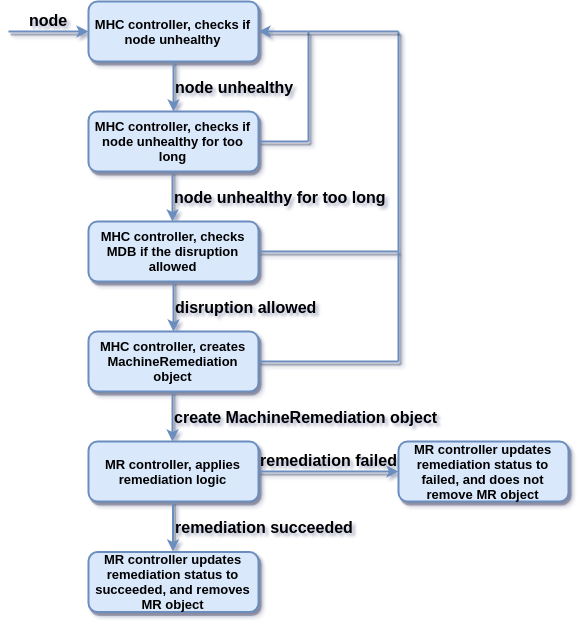

# Machine Remediation

## Remediation Flow



## Architecture

The machine remediation operator deploys components to monitor and remediate unhealthy machines for different platforms, it works on top of cluster-api controllers.

It should deploy three controllers:

* [machine-remediation](docs/machine-remediation.md) controller

## How to deploy

You can check the [GitHub releases](https://github.com/kubevirt/machine-remediation/releases) to get latest `yaml` file, that includes CRD's, RBAC rules and operator deployment and apply it to your cluster.

```bash
kubectl apply -f https://github.com/kubevirt/machine-remediation/releases/download/v0.3.3/machine-remediation.yaml
kubectl apply -f https://github.com/kubevirt/machine-remediation/releases/download/v0.3.3/machine-remediation-cr.yaml
```

After just wait until the operator will deploy all components.

## How to run e2e tests

You should have k8s or OpenShift environment with at least two worker nodes and run:

```bash
export KUBECONFIG=/dir/cluster/kubeconfig
make e2e-tests-run
```
