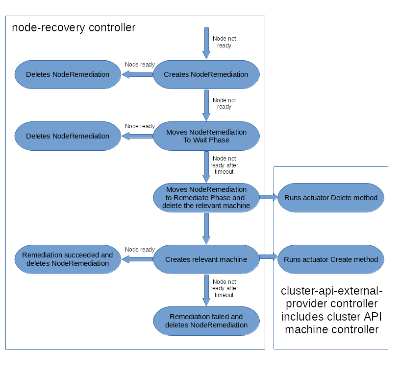

# Architecture

Node-Recovery delivers two things to provide the new functionality:

1. Additional types - so called [Custom Resource Definition](https://kubernetes.io/docs/concepts/extend-kubernetes/api-extension/custom-resources/) (CRD) - are added to the Kubernetes API
2. Additional controllers for cluster wide logic associated with this new types

Once all steps have been completed, you are able to

- create new objects of these new types in Kubernetes (NodeRemediation in our
  case)
- call to machine API

One a final note it is to say that both, the controllers are running
as Pods (or similar) _on top of_ the Kubernetes cluster, and are not installed
alongside of it.

The following diagram illustrates how the additional controllers and daemons
communicate with Kubernetes and where the additional types are stored:

## Application Layout

* Cluster
  * Node-Recovery Components
    * node-recovery
    * …
  * Cluster-API components
    * machine controller
    * …
